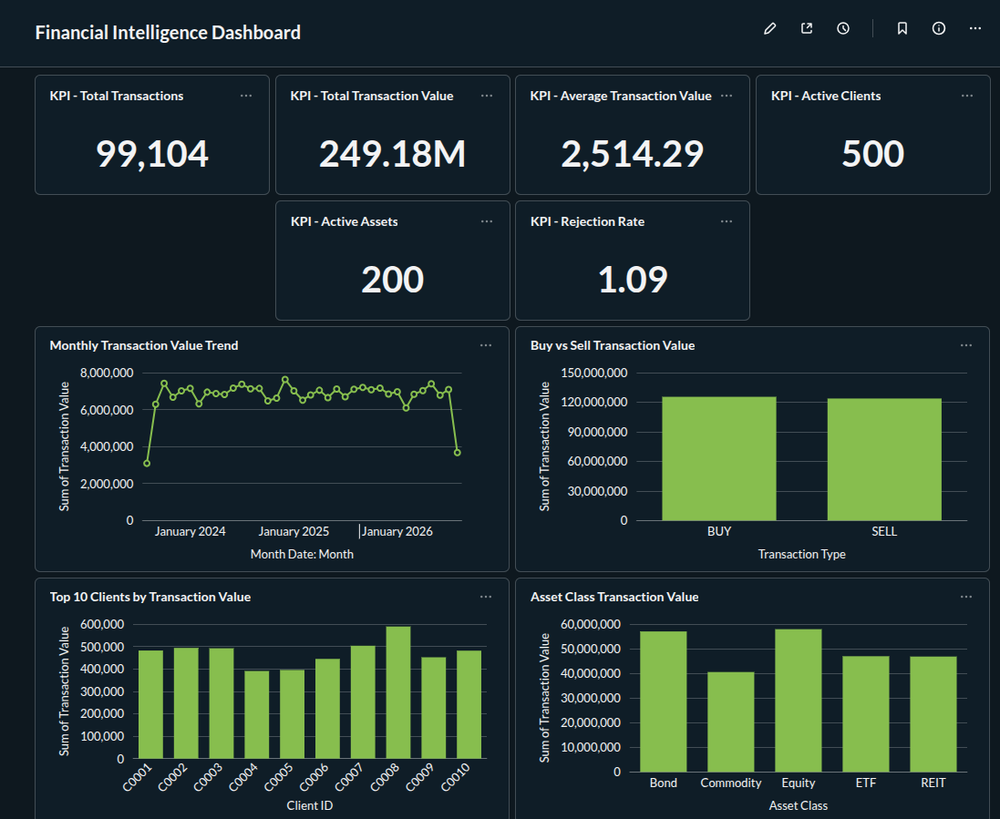

# Financial Data Intelligence Platform

An end-to-end financial data analytics platform that transforms raw transaction data into a validated PostgreSQL data warehouse and interactive BI dashboards.

The project demonstrates a complete data workflow covering data generation, ETL, data-quality validation, dimensional data warehousing, SQL analytics, financial KPI generation, and BI reporting.

---

## Project Overview

Financial datasets often contain inconsistent, incomplete, or invalid records that can affect downstream analysis.

This project implements a data pipeline that:

- Processes raw financial transaction data
- Detects and separates invalid records
- Loads validated data into a PostgreSQL dimensional warehouse
- Maintains an audit trail for rejected records
- Generates financial KPIs and analytical views
- Provides interactive business intelligence dashboards through Metabase
- Automates the complete workflow through a single Python pipeline

---
## Dashboard

The final Metabase dashboard provides an interactive view of financial performance, transaction activity, client behavior, asset-class performance, and data quality.

### Executive Dashboard


### Dashboard Analysis



### Dashboard Components

- Total transaction value
- Total transactions
- Average transaction value
- Active clients
- Active assets
- Buy vs Sell performance
- Monthly transaction trends
- Asset-class performance
- Top 10 clients
- Data-quality metrics
## Architecture

```text
                    RAW DATA
                       │
                       ▼
              ┌─────────────────┐
              │   Python ETL    │
              │ Cleaning &      │
              │ Transformation  │
              └────────┬────────┘
                       │
              ┌────────┴────────┐
              │                 │
              ▼                 ▼
        Valid Records     Rejected Records
              │                 │
              ▼                 ▼
      PostgreSQL Warehouse   Audit Log
              │
              ▼
       SQL Analytical Views
              │
              ▼
       Financial Analytics
              │
              ▼
          Metabase
              │
              ▼
     Financial Intelligence
          Dashboard


financial-data-intelligence/
│
├── data/
│   └── raw/
│       ├── assets.csv
│       ├── clients.csv
│       ├── transactions.csv
│       └── transactions_messy.csv
│
├── metabase/
│   └── docker-compose.yml
│
├── src/
│   ├── analytics/
│   │   ├── financial_kpis.py
│   │   └── portfolio_analysis.py
│   │
│   ├── data_generation/
│   │   ├── generate_data.py
│   │   └── inject_data_quality_issues.py
│   │
│   ├── etl/
│   │   ├── database_loader.py
│   │   └── transaction_etl.py
│   │
│   ├── validation/
│   │   └── transaction_validator.py
│   │
│   ├── database.py
│   └── pipeline.py
│
├── requirements.txt
├── README.md
└── .gitignore
